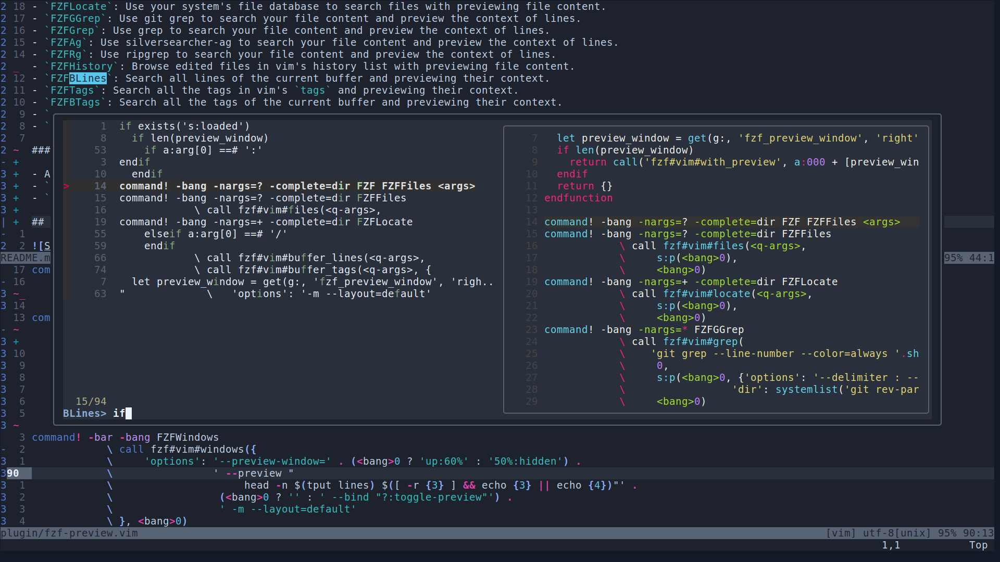

# fzf-preview.vim

fzf :heart: preview

## Preview Everywhere

The preview functionality of **fzf** in vim is great. However, only limited
commands of **fzf.vim** provide a preview window that you can press `?` key
to toggle. If you want to enhance your **fzf.vim** by enabling the preview
window everywhere, try this plugin! All of the commands support a `!` as one
of their arguments to start a full-screen window.

**NOTE** This plugin depends on **fzf** and **fzf.vim** so you need to install
them first. You may also need to put the line to load this plugin after the
line of installing **fzf.vim** in your plugin manager's configuration file
since the commands from **fzf.vim** may override the commands provided by this
plugin if you have `let g:fzf_command_prefix = 'FZF'` in your `.vimrc`.

**NOTE** To enable correct preview with `FZFTags`, you may need to add
`--excmd=number` to your ctags' command-line arguments to help locate the line
position of the tag. You also need to make sure the tags file is in the current
vim since the file paths in the tags file might be relative paths, or you need
to add `--tag-relative=no` to the arguments.

**NOTE** All the commands may require a **Unix-like** environment, or a **bash** emulator
on **Windows** (**WSL** or something else, and is in your `$PATH` variable).

## Dependencies

**fzf** 0.22.0 or above
**fzf.vim**

## Usage

Run a command, then press `?` to toggle preview.

## Commands

- `FZF/FZFFiles`: Search files with previewing file content.
- `FZFLocate`: Use your system's file database to search files with previewing file content.
- `FZFGGrep`: Use git grep to search your file content and preview the context of lines.
- `FZFGrep`: Use grep to search your file content and preview the context of lines.
- `FZFAg`: Use silversearcher-ag to search your file content and preview the context of lines.
- `FZFRg`: Use ripgrep to search your file content and preview the context of lines.
- `FZFHistory`: Browse edited files in vim's history list with previewing file content.
- `FZFBLines`: Search all lines of the current buffer and previewing their context.
- `FZFTags`: Search all the tags in vim's `tags` and previewing their context.
- `FZFBTags`: Search all the tags of the current buffer and previewing their context.
- `FZFMarks`: Search all the positions of vim's marks and preview their context. (Unix only, or won't be defined.)
- `FZFWindows`: Search all the vim's windows and preview their content. (Unix only, or won't be defined.)
- `FZFQuickFix/FZFLocList`': Search VIM's QuickFix/LocList entries with preview!

## Differences between Current fzf.vim's Builtin Commands with preview

- All comands support pressing `?` to toggle preview.
- The original `Ag` and `Rg` commands will also do fuzzy match on file names, which is annoying sometimes. Here they would only match lines.
- `FZFGGrep`, `FZFGrep`: Use `git grep` and `grep` to search file content, which the original fzf.vim doesn't provide.
- `FZFBLines`, `FZFTags`, `FZFMarks` and `FZFWindows`: The original fzf.vim does not support preview with those.
- `FZFQuickFix/FZFLocList`: The original fzf.vim does not provide these commands.

## Configuration

You can use the native **fzf.vim**'s preview window configuration variable `g:fzf_preview_window`
to customize the layout of the preview window, for example, `let g:fzf_preview_window = 'top:60%'`
to put the preview window at the top 60% of the fzf terminal buffer, the default value is `right`. If you don't want the preview window to be opened by default, you can set `let g:fzf_preview_window = right:hidden`.
## Screenshot

